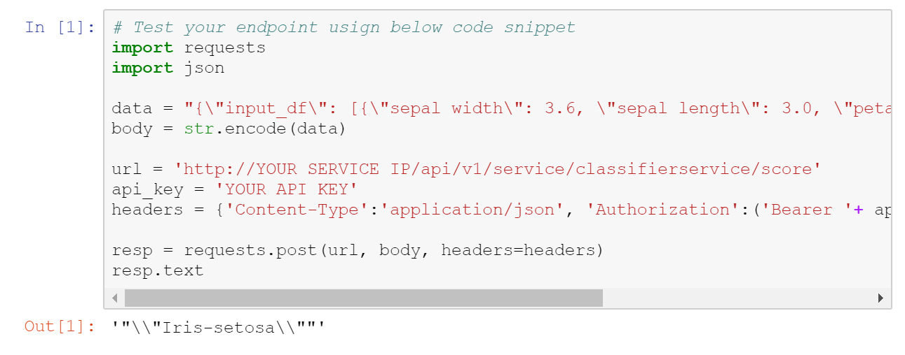
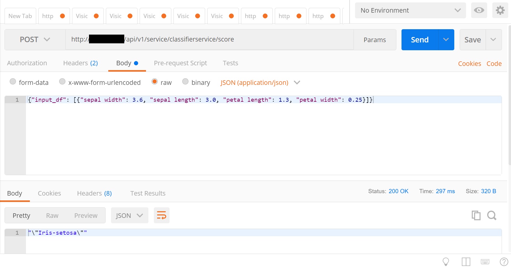

# Azure Machine Learning Workbench - Classifying Iris

This is a companion sample project of the Azure Machine Learning [QuickStart](https://docs.microsoft.com/azure/machine-learning/preview/quickstart-installation) and [Tutorials](https://docs.microsoft.com/azure/machine-learning/preview/tutorial-classifying-iris-part-1). Using the timeless [Iris flower dataset](https://en.wikipedia.org/wiki/Iris_flower_data_set), it walks you through the basics of preparing dataset, creating a model and deploying it as a web service.

If you would like to check all the steps what we did in demo you can follow

- [1- Preparing the data](https://docs.microsoft.com/en-us/azure/machine-learning/desktop-workbench/tutorial-classifying-iris-part-1)
- [2- Build models](https://docs.microsoft.com/en-us/azure/machine-learning/desktop-workbench/tutorial-classifying-iris-part-1)
- [3- Deploy models](https://docs.microsoft.com/en-us/azure/machine-learning/desktop-workbench/tutorial-classifying-iris-part-1) 
- [4- Publish Model via Jupyter Notebook]()

Especially for model deployment part you can follow [publish Jupyter Notebook](publish.ipynb) section to move step by step, After deployment into Azure Model Management tool, you can check your service with below python script in Jupyter notebook.

Also you can test in Postman to check the result

## QuickStart
Select `local` as the execution environment, and `iris_sklearn.py` as the script, and click **Run** button.  You can also set the _Regularization Rate_ by entering `0.01` in the **Arguments** control.  Changing the _Regularization Rate_ has an impact on the accuracy of the model, giving interesting results to explore.

## Exploring results
After running, you can check out the results in **Run History**.  Exploring the **Run History** will allow you to see the correlation between the parameters you entered and the accuracy of the models.  You can get individual run details by clicking a run in the **Run History** report or clicking the name of the run on the Jobs Panel to the right.  In this sample you will have richer results if you have `matplotlib` installed.

